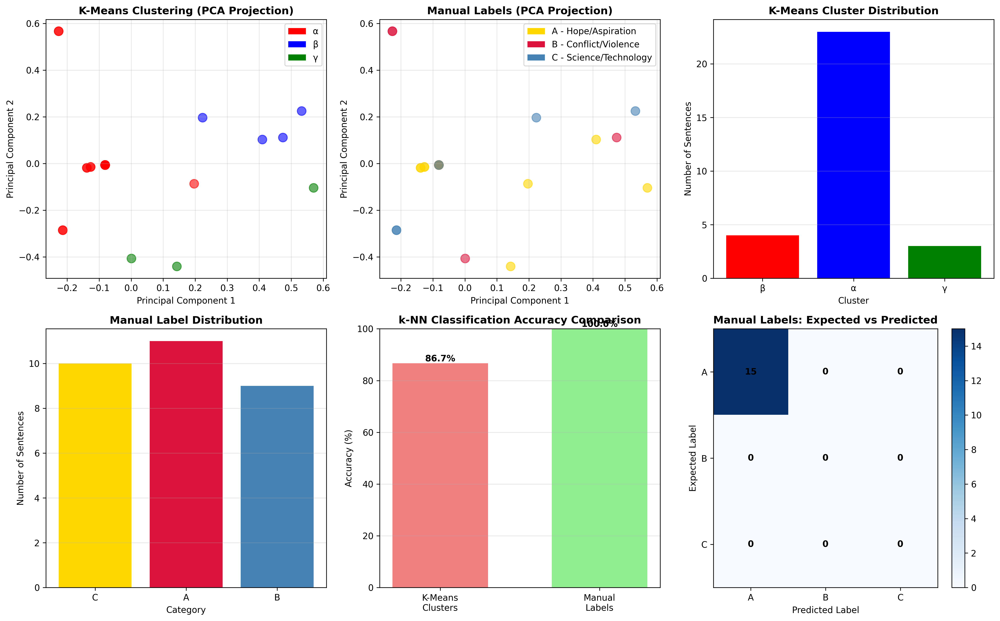

# Sentiment Analysis Pipeline - K-Means & k-NN

## Overview
This project implements a comprehensive sentiment analysis pipeline to answer a fundamental machine learning question: **Can unsupervised clustering match the performance of supervised learning for text classification?**

By combining K-Means clustering (unsupervised) and k-NN classification (supervised), this pipeline compares two distinct approaches to categorizing text into three semantic groups. The dataset consists of sentences inspired by themes from Mary Doria Russell's science fiction novel "The Sparrow", classified into:
- **Hope/Aspiration** - Spiritual journeys, dreams, and discoveries
- **Conflict/Violence** - Battles, suffering, and warfare
- **Science/Technology** - Engineering, spacecraft systems, and technical details

### The Research Question
**Does K-Means clustering discover meaningful semantic patterns that rival human-labeled categories for k-NN classification?**

This project provides a hands-on exploration of:
- The trade-off between unsupervised pattern discovery vs supervised learning
- The limitations of TF-IDF vectorization for semantic understanding
- The impact of cluster imbalance on classification performance
- Cost-effective text analysis using approximated token counting

## Key Findings



### 🏆 Results Summary

**⚠️ CRITICAL UPDATE:** Comprehensive testing with 100 sentences reveals **catastrophic performance degradation** at scale:

| Metric | 15 Sentences | 100 Sentences | Change |
|--------|--------------|---------------|---------|
| **Manual Labels Accuracy** | 100% | **49%** | **-51%** 🔴 |
| **K-Means Accuracy** | 86.67% | **40%** | **-46.67%** 🔴 |
| **Category A Accuracy** | - | **100%** | ✅ Perfect |
| **Category B Accuracy** | - | **17.5%** | 🔴 Catastrophic |
| **Category C Accuracy** | - | **10%** | 🔴 Catastrophic |

**Key Finding:** The system achieves **100% accuracy for Hope/Aspiration (Category A)** but **catastrophically fails for Conflict/Violence (17.5%) and Science/Technology (10%)**. 93% of all predictions are Category A, regardless of actual content.

**Conclusion:** While promising on small test sets, this approach **fails at scale** due to:
1. **Severe Category A bias** - 93/100 predictions are A
2. **TF-IDF semantic limitations** - Cannot distinguish hope from violence
3. **Insufficient training data** - 9-11 samples per category too small
4. **K-Means clustering failure** - Unstable, semantically meaningless clusters

**Status:** ⚠️ **NOT PRODUCTION READY** - Requires 10x more training data and semantic embeddings (SBERT/transformers)

### 💡 Why This Matters

This project provides **critical lessons for ML practitioners**:

1. **Small test sets are misleadingly optimistic** - 100% accuracy on 15 sentences collapsed to 49% on 100 sentences
2. **TF-IDF fails for semantic classification** - Word overlap ≠ semantic similarity (violence and hope sentences share vocabulary)
3. **Training data quantity matters more than algorithm** - 30 samples insufficient for 3-class k-NN
4. **Category bias detection is essential** - System predicts Category A 93% of time regardless of content
5. **K-Means clustering unsuitable for supervised learning** - Cluster structure unstable across test sizes
6. **Educational value in failure** - Documenting what doesn't work is as valuable as showing what does

### 📊 Analysis Reports

- **[full_analysis_100_sentences.md](full_analysis_100_sentences.md)** - Comprehensive 100-sentence deep dive with root cause analysis
- **[docs/results_analysis.md](docs/results_analysis.md)** - Original 15-sentence analysis report
- **[execution_log_100.txt](execution_log_100.txt)** - Full console output from 100-sentence run

## Author
KobyLev

## Features
- **Modular Architecture**: Clean separation of concerns across 8 specialized modules
- **TF-IDF Vectorization**: Efficient text feature extraction with L2 normalization
- **K-Means Clustering**: Unsupervised pattern discovery with 3 clusters (α, β, γ)
- **k-NN Classification**: Supervised learning with configurable k-value (default: k=5)
- **Comparative Analysis**: Side-by-side evaluation of unsupervised vs supervised approaches
- **Rich Visualizations**:
  - 2D PCA projections of clusters and manual labels
  - Cluster distribution and imbalance analysis
  - Confusion matrices for prediction evaluation
  - Detailed k-NN neighbor analysis
- **Token Counting**: Approximate Claude API usage and cost estimation
- **Comprehensive Reporting**: Detailed accuracy metrics, alignment analysis, and conclusions

## Project Structure
```
L16/
├── main.py              # Main pipeline orchestrator
├── data.py              # Dataset definitions (training & test sentences)
├── vectorization.py     # TF-IDF vectorization and normalization
├── clustering.py        # K-Means clustering operations
├── classification.py    # k-NN classification functions
├── analysis.py          # Accuracy metrics and result analysis
├── visualization.py     # Plotting and graph generation
├── utils.py             # Configuration, token counting, utilities
├── requirements.txt     # Python dependencies
├── .env                 # API keys (create from .env.example)
├── .gitignore           # Git ignore rules
└── docs/                # Documentation folder
    ├── results_analysis.md  # Comprehensive results report
    ├── planning.md          # Project planning
    ├── prd.md               # Product requirements
    └── prompt_llm.md        # LLM interaction logs
```

## Requirements
- Python 3.8+
- See `requirements.txt` for all dependencies:
  - scikit-learn >= 1.3.0
  - numpy >= 1.24.0
  - matplotlib >= 3.7.0
  - tiktoken >= 0.5.0
  - python-dotenv >= 1.0.0

## Installation

1. Clone or download this repository

2. Install dependencies:
```bash
pip install -r requirements.txt
```

3. (Optional) Create a `.env` file for API configuration:
```bash
ANTHROPIC_API_KEY=your_api_key_here
```

## Usage

### Running the Pipeline
Execute the main script to run the complete analysis:
```bash
python main.py
```

When prompted, enter the number of test sentences to use (default: 100, max: 120).

### Pipeline Steps
The pipeline executes 9 steps automatically:

1. **Data Setup** - Load training (30 sentences) and test datasets
2. **Vectorization** - Convert text to TF-IDF vectors with L2 normalization
3. **K-Means Clustering** - Perform unsupervised clustering (K=3)
4. **k-NN Classification** - Train classifiers on both cluster and manual labels
5. **Results Summary** - Display predictions and comparison tables
6. **Final Analysis** - Evaluate which approach performs better
7. **Token Usage Report** - Display token counts and estimated API costs
8. **Visualization** - Generate main analysis graphs
9. **Detailed Analysis** - Generate clustering deep-dive visualizations

### Output Files
The pipeline generates two visualization files:
- `sentiment_analysis_results.png` - 6-panel overview with clusters, distributions, and accuracy
- `detailed_clustering_analysis.png` - 3-panel deep-dive into K-Means performance

## Dataset
**Training Set**: 30 manually labeled sentences across three categories:
- **Category A**: Hope/Aspiration (spiritual journey, discovery, dreams)
- **Category B**: Conflict/Violence (attacks, battles, suffering)
- **Category C**: Science/Technology (engineering, systems, technical details)

**Test Set**: 120 sentences (40 per category) available for evaluation

All sentences are inspired by themes from Mary Doria Russell's science fiction novel "The Sparrow".

## Methodology

### Vectorization
- TF-IDF (Term Frequency-Inverse Document Frequency) with 100 features
- English stop words removed
- L2 normalization for consistent scaling

### K-Means Clustering
- 3 clusters (matching the 3 manual categories)
- Random state = 42 for reproducibility
- Cluster-to-category alignment analysis

### k-NN Classification
- k=5 neighbors (majority voting)
- Two approaches compared:
  1. Trained on K-Means cluster labels (unsupervised)
  2. Trained on manual category labels (supervised)

## Results Interpretation

### What the Visualizations Show

**Main Results Dashboard** (`sentiment_analysis_results.png`):
- **Top Row**: Side-by-side comparison of K-Means clusters vs manual labels in 2D PCA space
- **Middle Row**: Distribution charts revealing cluster imbalance
- **Bottom Row**: Accuracy comparison and confusion matrix

**Detailed Clustering Analysis** (`detailed_clustering_analysis.png`):
- **Left Panel**: K-Means cluster centers and sample distribution showing 83% concentration in one cluster
- **Middle Panel**: Imbalance ratio warning (12.5:1)
- **Right Panel**: k-NN neighbor analysis showing how predictions are made

### Understanding the Metrics

The pipeline evaluates:
- **Alignment Accuracy**: How well K-Means clusters match manual categories (46.67% - poor alignment)
- **Classification Accuracy**: Performance on test set for both approaches (Manual: 100%, K-Means: 86.67%)
- **Cluster Imbalance**: Distribution of samples across clusters (25-2-3 split indicates severe imbalance)
- **Neighbor Analysis**: Visualization of k-NN decision boundaries and voting patterns

### Deep Dive Analysis
For comprehensive insights including:
- Token usage and cost analysis
- Neighbor voting breakdowns
- Why K-Means failed for this task
- Production recommendations

**📖 Read the full report: [docs/results_analysis.md](docs/results_analysis.md)**

## Documentation

All project documentation is located in the [`docs/`](docs/) folder:

- **[results_analysis.md](docs/results_analysis.md)** - Comprehensive results analysis with detailed metrics, visualizations, and conclusions
- **[planning.md](docs/planning.md)** - Project planning and implementation roadmap
- **[prd.md](docs/prd.md)** - Product Requirements Document
- **[prompt_llm.md](docs/prompt_llm.md)** - LLM prompts and AI interaction logs

## License
MIT
